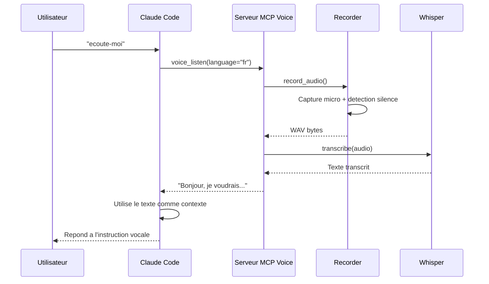
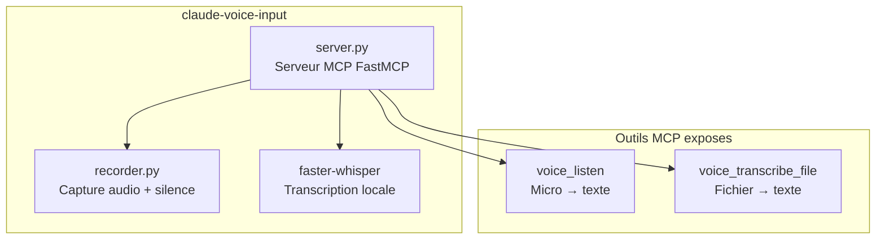
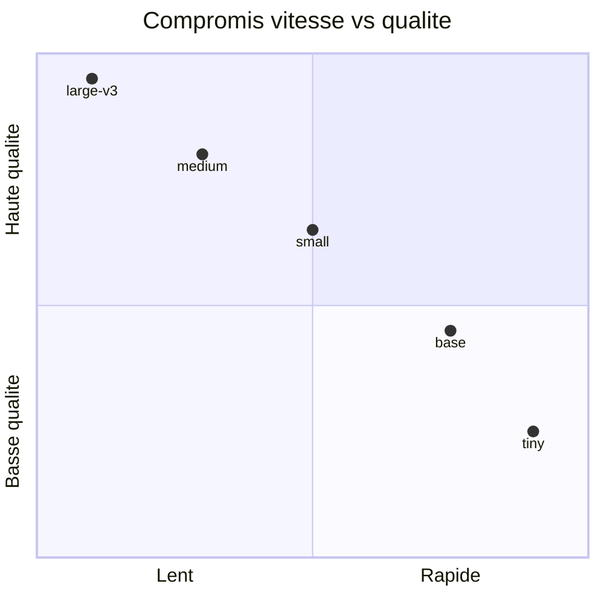

# claude-voice-input

Serveur MCP local pour parler a Claude au lieu de taper. Utilise [faster-whisper](https://github.com/SYSTRAN/faster-whisper) pour la transcription entierement locale — rien n'est envoye dans le cloud.

## Architecture


## Flux de fonctionnement



## Composants



## Installation rapide

```bash
curl -fsSL https://raw.githubusercontent.com/Baseline-quebec/claude-voice-input/main/install.sh | bash
```

Le script fait tout automatiquement :

1. Verifie Python 3.10+
2. Installe PortAudio si manquant
3. Clone le repo dans `~/.claude-voice-input`
4. Cree un venv dedie et installe les dependances
5. Configure le serveur MCP dans `~/.claude/settings.json`

### Avec un modele specifique

```bash
curl -fsSL https://raw.githubusercontent.com/Baseline-quebec/claude-voice-input/main/install.sh | WHISPER_MODEL=medium bash
```

## Installation manuelle

```bash
git clone https://github.com/Baseline-quebec/claude-voice-input.git
cd claude-voice-input

# Dependance systeme (PortAudio)
sudo apt install portaudio19-dev   # Ubuntu/Debian
brew install portaudio              # macOS

# Installer
pip install -e .
```

Ajouter dans `~/.claude/settings.json` :

```json
{
  "mcpServers": {
    "voice": {
      "command": "/chemin/vers/venv/bin/claude-voice-input",
      "env": {
        "WHISPER_MODEL": "base",
        "WHISPER_DEVICE": "auto",
        "WHISPER_COMPUTE_TYPE": "int8"
      }
    }
  }
}
```

## Configuration

### Variables d'environnement

| Variable | Defaut | Description |
|----------|--------|-------------|
| `WHISPER_MODEL` | `base` | Modele Whisper (voir tableau ci-dessous) |
| `WHISPER_DEVICE` | `auto` | `cpu`, `cuda`, ou `auto` |
| `WHISPER_COMPUTE_TYPE` | `int8` | `int8`, `float16`, `float32` |
| `CLAUDE_VOICE_DIR` | `~/.claude-voice-input` | Repertoire d'installation |

### Modeles Whisper



| Modele | RAM | Vitesse | Qualite | Cas d'usage |
|--------|-----|---------|---------|-------------|
| `tiny` | ~1 Go | Tres rapide | Correcte | Tests, instructions simples |
| `base` | ~1 Go | Rapide | Bonne | Usage quotidien (recommande) |
| `small` | ~2 Go | Moyen | Tres bonne | Contexte technique |
| `medium` | ~5 Go | Lent | Excellente | Dictee longue, accents forts |
| `large-v3` | ~10 Go | Tres lent | Maximale | Transcription de precision |

## Outils MCP

### `voice_listen`

Enregistre depuis le microphone et transcrit au silence.

| Parametre | Type | Defaut | Description |
|-----------|------|--------|-------------|
| `language` | `str` | `"fr"` | Code langue (`"fr"`, `"en"`, etc.) |
| `silence_duration` | `float` | `2.0` | Secondes de silence avant arret |
| `max_duration` | `float` | `120.0` | Duree maximale d'enregistrement |

### `voice_transcribe_file`

Transcrit un fichier audio existant.

| Parametre | Type | Defaut | Description |
|-----------|------|--------|-------------|
| `file_path` | `str` | — | Chemin du fichier (wav, mp3, m4a, etc.) |
| `language` | `str` | `"fr"` | Code langue |

## Exemples d'utilisation dans Claude Code

```
> ecoute-moi
  [Claude appelle voice_listen, vous parlez, il recoit le texte]

> transcris le fichier ~/meeting.wav
  [Claude appelle voice_transcribe_file]

> ecoute mes instructions en anglais
  [Claude appelle voice_listen avec language="en"]
```

## Mise a jour

Relancer le script d'installation — il fait un `git pull` automatiquement :

```bash
curl -fsSL https://raw.githubusercontent.com/Baseline-quebec/claude-voice-input/main/install.sh | bash
```

## Licence

MIT — [Baseline](https://baseline.quebec)
